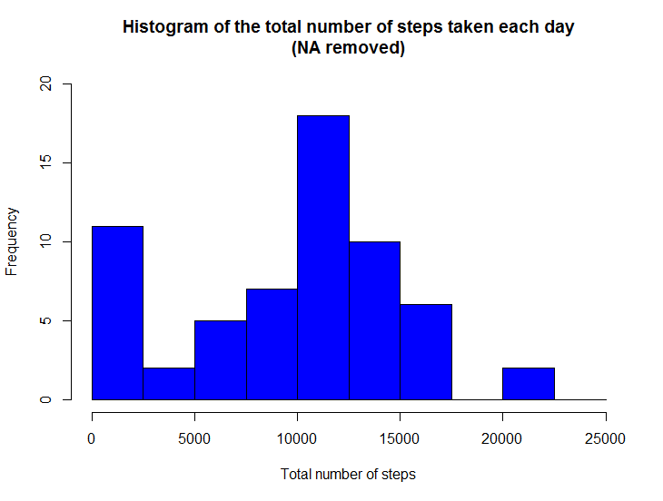
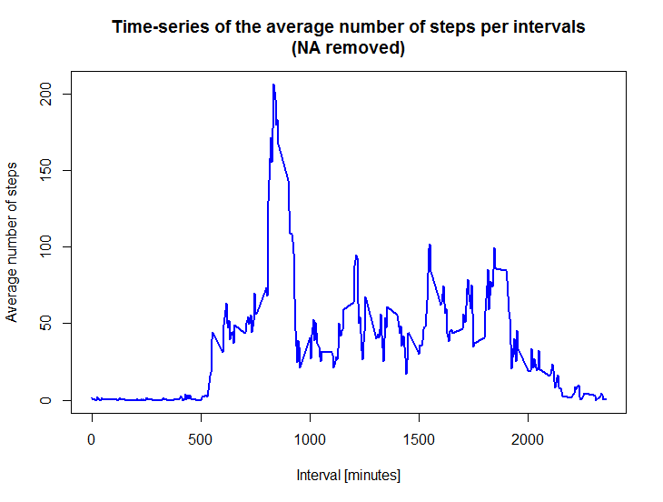
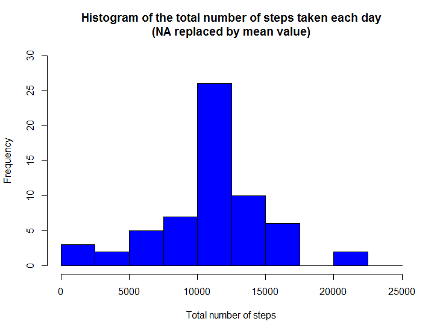
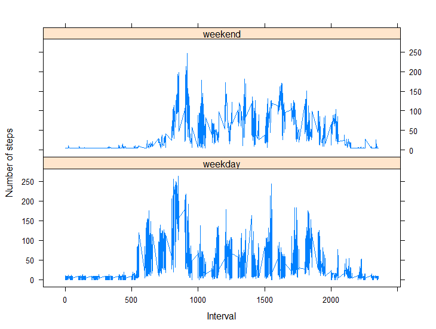

---"
title: "Reproducible Research: Peer Assessment 1"
author: "Azodian""
output: html_document
---
# Reproducible Research: Peer Assessment 1

## Loading and preprocessing the data
```{r}
activity_raw <- read.csv("activity.csv", stringsAsFactors=FALSE)

activity_raw$date <- as.POSIXct(activity_raw$date, format="%Y-%m-%d")

activity_raw <- data.frame(date=activity_raw$date, 
                           weekday=tolower(weekdays(activity_raw$date)), 
                           steps=activity_raw$steps, 
                           interval=activity_raw$interval)

activity_raw <- cbind(activity_raw, 
                      daytype=ifelse(activity_raw$weekday == "saturday" | 
                                       activity_raw$weekday == "sunday", "weekend", 
                                     "weekday"))

activity <- data.frame(date=activity_raw$date, 
                       weekday=activity_raw$weekday, 
                       daytype=activity_raw$daytype, 
                       interval=activity_raw$interval,
                       steps=activity_raw$steps)

```
## Histogram of the steps taken each day
```{r}
sum_data <- aggregate(activity$steps, by=list(activity$date), FUN=sum, na.rm=TRUE)

names(sum_data) <- c("date", "total")

hist(sum_data$total, 
     breaks=seq(from=0, to=25000, by=2500),
     col="blue", 
     xlab="Total number of steps", 
     ylim=c(0, 20), 
     main="Histogram of the total number of steps taken each day\n(NA removed)")
```


## What is mean total number of steps taken per day?
```{r}
mean(sum_data$total)
```
```
## [1] 9354.23
```
```{r}
median(sum_data$total)
```
```
## [1] 10395
```

## What is the average daily activity pattern?
```{r}
mean_data <- aggregate(activity$steps, 
                       by=list(activity$interval), 
                       FUN=mean, 
                       na.rm=TRUE)

names(mean_data) <- c("interval", "mean")

plot(mean_data$interval, 
     mean_data$mean, 
     type="l", 
     col="blue", 
     lwd=2, 
     xlab="Interval [minutes]", 
     ylab="Average number of steps", 
     main="Time-series of the average number of steps per intervals\n(NA removed)")
```

```{r}
max_pos <- which(mean_data$mean == max(mean_data$mean))

max_interval <- mean_data[max_pos, 1]
```
```
## [1] 835
```
## Imputing missing values
```{r}
NA_count <- sum(is.na(activity$steps))

na_pos <- which(is.na(activity$steps))

mean_vec <- rep(mean(activity$steps, na.rm=TRUE), times=length(na_pos))

activity[na_pos, "steps"] <- mean_vec

sum_data <- aggregate(activity$steps, by=list(activity$date), FUN=sum)

names(sum_data) <- c("date", "total")

hist(sum_data$total, 
     breaks=seq(from=0, to=25000, by=2500),
     col="blue", 
     xlab="Total number of steps", 
     ylim=c(0, 30), 
     main="Histogram of the total number of steps taken each day\n(NA replaced by mean value)")
```

```{r}
mean(sum_data$total)

median(sum_data$total)
```
## Are there differences in activity patterns between weekdays and weekends?
```{r}
library(lattice)

mean_data <- aggregate(activity$steps, 
                       by=list(activity$daytype, 
                               activity$weekday, activity$interval), mean)

names(mean_data) <- c("daytype", "weekday", "interval", "mean")

xyplot(mean ~ interval | daytype, mean_data, 
       type="l", 
       lwd=1, 
       xlab="Interval", 
       ylab="Number of steps", 
       layout=c(1,2))
```
